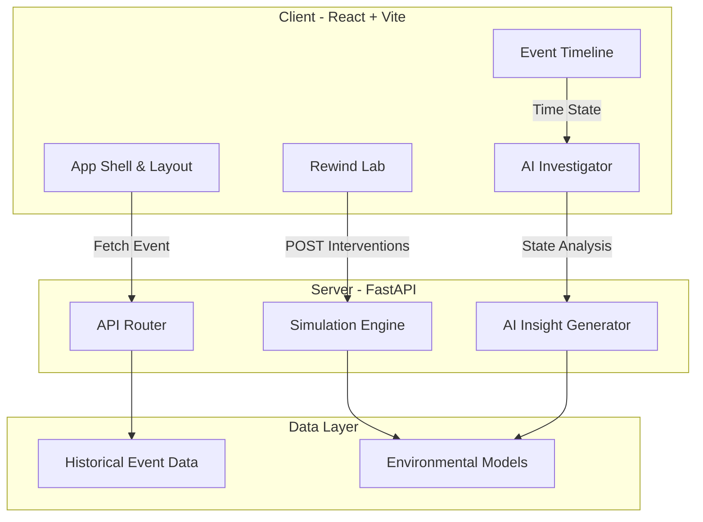

# 🌍 RewindAI
**Environmental intelligence for understanding what happened — and what could have changed it.**

[](https://opensource.org/licenses/MIT)
[](https://fastapi.tiangolo.com)
[](https://reactjs.org/)
[](https://vitejs.dev/)

RewindAI is a world-class environmental event time machine. Instead of only predicting environmental risk, the system reconstructs how an environmental event developed over time, identifies model contribution signals, and allows the user to **rewind the event and simulate interventions**.

---

## 🚀 The Core Product Loop


## 🏗️ Architecture



## ✨ Features

- **Cinematic Event Exploration:** Understand a catastrophic event from T-48h down to the present moment.
- **AI Investigator (3 Modes):** Understand model contribution signals in **Science**, **Planner**, or **Citizen** language.
- **The Rewind Lab:** Adjust critical real-world infrastructure parameters (Drainage, Vegetation, Warning Time).
- **Physical vs. Human Impact Engine:** Simulating a change accurately separates the unchangeable physical reality from preventable human exposure.
- **Premium Interface:** Built with Shadcn/UI, Tailwind CSS, and Framer Motion, inspired by Apple, Linear, and Stripe for maximum visual clarity.

## 💻 Installation

### Prerequisites
- Node.js (v18+)
- Python (3.10+)
- uv (Python Package Manager)

### Backend Setup
```bash
cd backend
uv venv
# Activate virtual environment (Windows)
.venv\Scripts\activate
# Install dependencies
uv pip install -r requirements.txt
# Run the server
uvicorn app.main:app --reload
```

### Frontend Setup
```bash
cd frontend
npm install
npm run dev
```

## 📂 Project Structure

```text
rewind/
├── backend/
│   ├── app/
│   │   ├── main.py         # FastAPI application entrypoint
│   │   ├── models/         # Pydantic schemas (EventState, AIExplanation)
│   │   └── services/       # Simulation engines and AI logic
│   └── requirements.txt
├── frontend/
│   ├── src/
│   │   ├── components/     # RewindLab, AIExplanation, EventTimeline, etc.
│   │   ├── App.tsx         # Main Layout & Application Shell
│   │   ├── index.css       # Tailwind entry
│   │   └── types.ts        # TypeScript interfaces
│   ├── tailwind.config.js  # Theme configuration (Colors, Typography)
│   └── package.json
└── README.md
```

## 📄 License
This project is licensed under the MIT License - see the [LICENSE](LICENSE) file for details.
