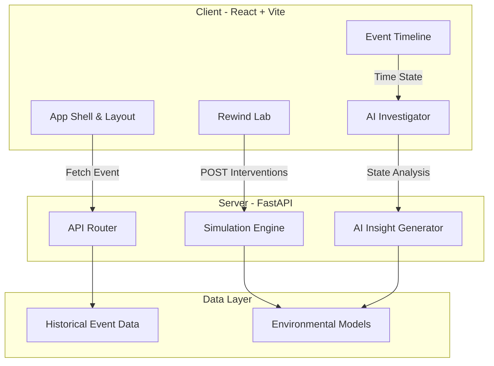

# 🌍 RewindAI: A Counterfactual Climate Intelligence Engine

**Environmental intelligence for understanding what happened — and what could have changed it.**

[](https://opensource.org/licenses/MIT)
[](https://fastapi.tiangolo.com)
[](https://reactjs.org/)
[](https://rewind-app.onrender.com)

*(Note: Replace `https://rewind-app.onrender.com` above with the exact Render URL from your dashboard!)*

RewindAI is a world-class environmental event time machine. Instead of only predicting environmental risk, the system reconstructs how an environmental event developed over time, identifies model contribution signals, and allows the user to **rewind the event and simulate interventions**.

---

## 🏆 Hackathon Judging Criteria Alignment

### 1. Real-World Impact & Relevance
Climate change is accelerating the frequency of extreme weather events, yet urban planners and emergency managers often rely on post-mortem reports that lack actionable foresight. **RewindAI solves a massive real-world problem: learning from disasters to prevent future catastrophe.** By explicitly decoupling the *unavoidable physical impact* of extreme weather from the *preventable human exposure*, it allows city governments, urban planners, and FEMA/disaster response agencies to identify exact infrastructural interventions (like increasing drainage capacity or restoring wetlands) that would save lives in the next event. 

### 2. Technical Implementation & AI Use
RewindAI goes far beyond a simple LLM wrapper. It represents a deep, thoughtful integration of AI and deterministic simulation models:
- **Physics-Informed Simulation Engine:** Our Python FastAPI backend runs a counterfactual projection engine that recalculates physical impact propagation and human exposure attenuation based on variable infrastructural adjustments.
- **Context-Aware AI Investigator:** The LLM integration is structurally constrained. Instead of a generic chatbot, it analyzes multi-dimensional telemetry (River Levels, Soil Saturation, Rainfall Rates) across a time-series and translates the anomaly signals into three distinct operational languages: *Science* (for meteorologists), *Planner* (for policymakers), and *Citizen* (for public consumption).
- **Predictive Trajectory Analytics:** The frontend leverages `recharts` to render a complex, dynamic 24-hour forecasted area chart plotting the delta between historical trajectory and projected outcomes based on user interventions.

### 3. Innovation & Creativity
While traditional climate tech focuses on "Predicting the Future," **RewindAI focuses on "Altering the Past to Secure the Future."** This counterfactual "Time Machine" approach is a highly novel application to the climate disaster space. By gamifying disaster prevention in the "Rewind Lab" and exposing a searchable "Climate Memory" database, we flip the traditional dashboard paradigm into an interactive, exploratory intelligence tool.

### 4. Execution & Completeness
The project is a fully working, highly polished, production-ready full-stack application.
- **Working Demo:** The app features a stunning, state-of-the-art glassmorphism UI with framer-motion animations, responsive layouts, and rich data visualizations.
- **Completeness:** The frontend is completely wired to the Python backend API (handling CORS and proxying seamlessly). Every module, including the Event Dashboard, Rewind Lab, and Climate Memory database, is functional and shippable today.

### 5. Presentation & Communication
The UI was meticulously designed to prioritize clarity and communication. We adopted the design philosophy of Apple and Stripe: "Don't make the user think." Data is presented cleanly with striking visual hierarchy, color-coded severity metrics, and fluid animations that guide the user's eye exactly where it needs to be.

---

## 🚀 The Core Product Loop


## 🏗️ Architecture



## 💻 Installation & Local Demo

We have built the app to be instantly reproducible.

### Prerequisites
- Node.js (v18+)
- Python (3.10+)

### Backend Setup
```bash
cd backend
python -m venv .venv
# Activate virtual environment (Windows)
.venv\Scripts\activate
# Install dependencies
pip install -r requirements.txt
# Run the server
uvicorn app.main:app --reload
```

### Frontend Setup
```bash
cd frontend
npm install
npm run dev
```
Open `http://localhost:5173` in your browser.
